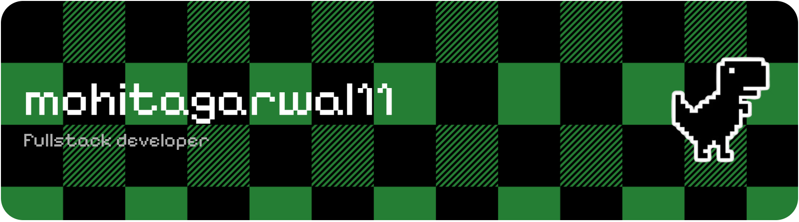
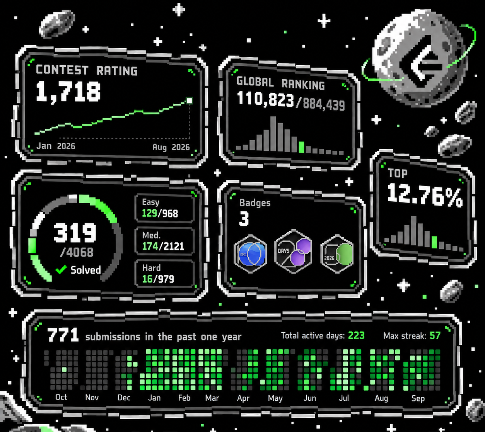

 

## Some facts about me:

- Complex Problem Solving
- Performance Optimization
- Continuous Learning
- Building From Scratch

## Tech Stack:

## Github Stats:

  
  

  

 

## Something I'm proud of recently:

  

